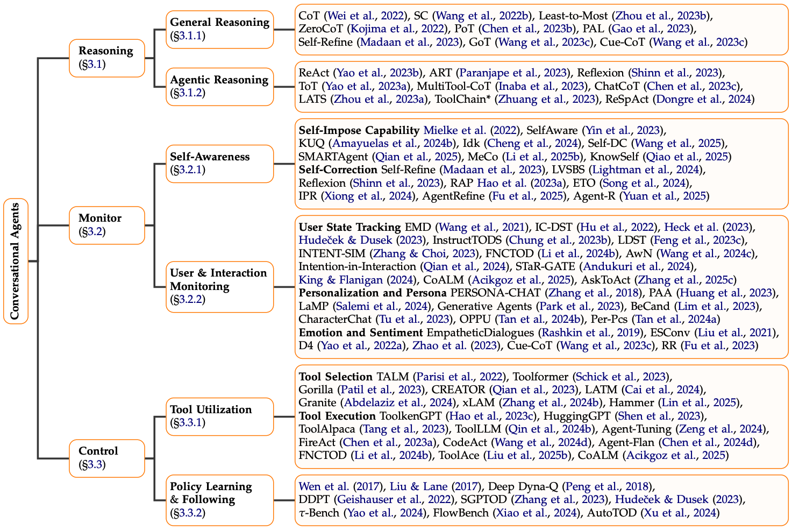
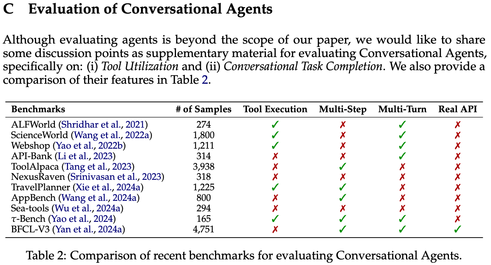

# 💫 Awesome Conversational Agents
[](https://arxiv.org/abs/2504.16939) [](https://awesome.re) [](https://opensource.org/license/MIT) []([YES](https://github.com/emrecanacikgoz/conversational-agents-survey/)) []()<br>
This repository is a curated and actively maintained collection of papers on Conversational Agents, most of which are discussed in our paper. We always welcome community contributions through PRs!

**[A Desideratum for Conversational Agents: Capabilities, Challenges, and Future Directions](https://arxiv.org/abs/2504.16939)**<br>
---
[Emre Can Acikgoz](https://emrecanacikgoz.github.io/), [Cheng Qian](https://qiancheng0.github.io/), [Hongru Wang](https://rulegreen.github.io/), [Vardhan Dongre](https://vardhandongre.github.io/), [Xiusi Chen](https://xiusic.github.io/), [Heng Ji](https://blender.cs.illinois.edu/hengji.html), [Dilek Hakkani-Tür](https://siebelschool.illinois.edu/about/people/faculty/dilek), [Gokhan Tur](https://siebelschool.illinois.edu/about/people/faculty/gokhan)


Recent advances in Large Language Models (LLMs) have propelled conversational AI from traditional dialogue systems into sophisticated agents capable of autonomous actions, contextual awareness, and multi-turn interactions with users. Yet, fundamental questions about their capabilities, limitations, and paths forward remain open. This survey paper presents a desideratum for next-generation Conversational Agents—*what has been achieved*, *what challenges persist*, and *what must be done for more scalable systems that approach human-level intelligence*. To that end, we systematically analyze LLM-driven Conversational Agents by organizing their capabilities into three primary dimensions: (i) **Reasoning**—logical, systematic thinking inspired by human intelligence for decision making, (ii) **Monitoring**—encompassing self-awareness and user interaction monitoring, and (iii) **Control**—focusing on tool utilization and policy following. Building upon this, we introduce a novel taxonomy by classifying recent work on Conversational Agents around our proposed desideratum. We identify critical research gaps and outline key directions, including **realistic evaluations**, **long-term multi-turn reasoning skills**, **self-evolution capabilities**, **collaborative and multi-agent task completion**, **personalization**, and **proactivity**. This work aims to provide a structured foundation, highlight existing limitations, and offer insights into potential future research directions for Conversational Agents, ultimately advancing progress toward Artificial General Intelligence (AGI).

---

## 📝 Taxonomy and Related Works


- [1. 🧠 Reasoning](#1-🧠-reasoning)
  - [1.1 General Reasoning](#11-general-reasoning)
  - [1.2 Agentic Reasoning](#12-agentic-reasoning)
- [2. 🔎 Monitor](#2-🔎-monitor)
  - [2.1 Self Awareness](#21-self-awareness)
    - [2.1.1 Self-Impose Capability ](#211-self-impose-capability)
    - [2.1.2 Self-Correction ](#212-self-correction)
  - [2.2 User and Interaction Monitoring](#22-user-and-interaction-monitoring)
    - [2.2.1 User State Tracking ](#221-user-state-tracking)
    - [2.2.2 Personalization and Persona ](#222-personalization-and-persona)
    - [2.2.3 Emotion and Sentiment ](#223-emotion-and-sentiment)
- [3. 🛠️ Control](#3-🛠️-control)
  - [3.1 Tool Utilization](#31-tool-utilization)
    - [3.1.1 Tool Selection](#311-tool-selection)
    - [3.1.2 Tool Execution](#312-tool-execution)
  - [3.2 Policy Learning and Following](#32-policy-learning-and-following)
- [📊 Appendix A: Evaluation of Conversational Agents](#📊-appendix-a-evaluation-of-conversational-agents)
- [🤓 Appendix B: Helpful Surveys Mentioned in the Paper](#🤓-appendix-b-helpful-surveys-mentioned-in-the-paper)

---

## 1. 🧠 Reasoning

### 1.1 General Reasoning
- [2022/01] **Chain-of-thought prompting elicits reasoning in large language models.** *Jason Wei et al. NeurIPS 2022.* [[paper](https://arxiv.org/abs/2201.11903)]
- [2022/03] **Self-Consistency Improves Chain of Thought Reasoning in Language Models.** *Xuezhi Wang et al. ICLR 2023.* [[paper](https://arxiv.org/abs/2203.11171)]
- [2022/05] **Least-to-Most Prompting Enables Complex Reasoning in Large Language Models.** *Denny Zhou et al. ICLR 2023.* [[paper](https://arxiv.org/abs/2205.10625)]
- [2022/05] **Large Language Models are Zero-Shot Reasoners.** *Takeshi Kojima et al. NeurIPS 2022.* [[paper](https://arxiv.org/abs/2205.11916)]
- [2022/11] **PAL: Program-aided Language Models.** *Luyu Gao et al. ICML 2023.* [[paper](https://arxiv.org/abs/2211.10435) / [code](https://github.com/reasoning-machines/pal)]
- [2022/11] **Program of Thoughts Prompting: Disentangling Computation from Reasoning for Numerical Reasoning Tasks.** *Wenhu Chen et al. TMLR 2023.* [[paper](https://arxiv.org/abs/2211.12588)]
- [2023/03] **Self-refine: Iterative refinement with self-feedback.** *Aman Madaan et al. NeurIPS 2023.* [[paper](https://arxiv.org/abs/2303.17651) / [code](https://github.com/madaan/self-refine)]
- [2023/08] **Graph of thoughts: Solving elaborate problems with large language models.** *Maciej Besta et al. AAAI 2024.* [[paper](https://arxiv.org/abs/2308.09687) / [code](https://github.com/spcl/graph-of-thoughts)]
- [2023/08] **Cue-CoT: Chain-of-thought Prompting for Responding to In-depth Dialogue Questions with LLMs.** *Hongru Wang et al. EMNLP 2023 Findings.* [[paper](https://arxiv.org/abs/2305.11792) / [code](https://github.com/ruleGreen/Cue-CoT)]

### 1.2 Agentic Reasoning
- [2022/10] **ReAct: Synergizing Reasoning and Acting in Language Models.** *Shunyu Yao et al. ICLR 2023.* [[paper](https://arxiv.org/abs/2210.03629) / [code](https://github.com/ysymyth/ReAct)]
- [2023/03] **Art: Automatic multi-step reasoning and tool-use for large language models.** *Bhargavi Paranjape et al. arXiv.* [[paper](https://arxiv.org/abs/2303.09014) / [code](https://github.com/bhargaviparanjape/language-programmes/)]
- [2023/03] **Reflexion: Language Agents with Verbal Reinforcement Learning.** *Noah Shinn et al. NeurIPS 2023.* [[paper](https://arxiv.org/abs/2303.11366) / [code](https://github.com/noahshinn/reflexion)]
- [2023/05] **Tree of Thoughts: Deliberate Problem Solving with Large Language Models.** *Shunyu Yao et al. NeurIPS 2023.* [[paper](https://arxiv.org/abs/2305.10601) / [code](https://github.com/princeton-nlp/tree-of-thought-llm)]
- [2023/05] **MultiTool-CoT: GPT-3 Can Use Multiple External Tools with Chain of Thought Prompting.** *Tatsuro Inaba et al. ACL 2023.* [[paper](https://arxiv.org/abs/2305.16896) / [code](https://github.com/tatsuropfgt/MultiTool-CoT)]
- [2023/05] **ChatCoT: Tool-Augmented Chain-of-Thought Reasoning on Chat-based Large Language Models.** *Zhipeng Chen et al. EMNLP 2023 Findings.* [[paper](https://arxiv.org/abs/2305.14323) / [code](https://github.com/RUCAIBox/ChatCoT)]
- [2023/10] **Language Agent Tree Search Unifies Reasoning, Acting, and Planning in Language Models.** *Andy Zhou et al. ICML 2024.* [[paper](https://arxiv.org/abs/2310.04406) / [code](https://github.com/lapisrocks/LanguageAgentTreeSearch)]
- [2023/10] **ToolChain: Efficient Action Space Navigation in Large Language Models with A Search.** *Yuchen Zhuang et al. ICLR 2024.* [[paper](https://arxiv.org/abs/2310.13227)]
- [2024/11] **ReSpAct: Harmonizing Reasoning, Speaking, and Acting Towards Building Large Language Model-Based Conversational AI Agents.** *Vardhan Dongre et al. arXiv 2024.* [[paper](https://arxiv.org/abs/2411.00927) / [code](https://github.com/vardhandongre/Respact)]


## 2. 🔎 Monitor

### 2.1 Self Awareness

#### 2.1.1 Self-Impose Capability 
- [2020/12] **Reducing conversational agents' overconfidence through linguistic calibration.** *Sabrina J. Mielke et al. TACL 2022.* [[paper](https://arxiv.org/abs/2012.14983)]
- [2023/05] **Do Large Language Models Know What They Don't Know?.** *Zhangyue Yin et al. ACL 2023 Findings.* [[paper](https://arxiv.org/abs/2305.18153) / [code](https://github.com/yinzhangyue/SelfAware)]
- [2023/05] **Knowledge of Knowledge: Exploring Known-Unknowns Uncertainty with Large Language Models.** *Alfonso Amayuelas et al. ACL 2024 Findings.* [[paper](https://arxiv.org/abs/2305.13712) / [code](https://github.com/amayuelas/knowledge-of-knowledge)]
- [2023/07] **Investigating the Factual Knowledge Boundary of Large Language Models with Retrieval Augmentation.** *Ruiyang Ren et al. COLING 2025.* [[paper](https://arxiv.org/abs/2307.11019) / [code](https://github.com/RUCAIBox/LLM-Knowledge-Boundary)]
- [2024/01] **Can AI Assistants Know What They Don't Know?.** *Qinyuan Cheng et al. ICML 2024.* [[paper](https://arxiv.org/abs/2401.13275) / [code](https://github.com/OpenMOSS/Say-I-Dont-Know)]
- [2024/02] **Self-DC: When to Reason and When to Act? Self Divide-and-Conquer for Compositional Unknown Questions.** *Hongru Wang et al. arXiv.* [[paper](https://arxiv.org/abs/2402.13514)]
- [2025/02] **SMART: Self-Aware Agent for Tool Overuse Mitigations.** *Cheng Qian et al. arXiv.* [[paper](https://arxiv.org/abs/2502.11435) / [code](https://github.com/qiancheng0/Open-SMARTAgent)]
- [2025/02] **Adaptive Tool Use in Large Language Models with Meta-Cognition Trigger.** *Wenjun Li et al. arXiv.* [[paper](https://arxiv.org/abs/2502.12961)]
- [2025/03] **Agentic Knowledgeable Self-awareness.** *Shuofei Qiao et al. ICLR 2025 Workshop.* [[paper](https://openreview.net/forum?id=PGdSLjYwMT)]


#### 2.1.2 Self-Correction 
- [2023/03] **Self-refine: Iterative refinement with self-feedback.** *Aman Madaan et al. NeurIPS 2023.* [[paper](https://arxiv.org/abs/2303.17651) / [code](https://github.com/madaan/self-refine)]
- [2023/03] **Reflexion: Language Agents with Verbal Reinforcement Learning.** *Noah Shinn et al. NeurIPS 2023.* [[paper](https://arxiv.org/abs/2303.11366) / [code](https://github.com/noahshinn/reflexion)]
- [2023/05] **Let's Verify Step by Step.** *Hunter Lightman et al. ICLR 2024.* [[paper](https://arxiv.org/abs/2305.20050)]
- [2023/05] **Reasoning with Language Model is Planning with World Model.** *Shibo Hao et al. EMNLP 2023.* [[paper](https://arxiv.org/abs/2305.14992) / [code](https://github.com/maitrix-org/llm-reasoners)]
- [2024/03] **Trial and Error: Exploration-Based Trajectory Optimization for LLM Agents.** *Yifan Song et al. ACL 2024.* [[paper](https://arxiv.org/abs/2403.02502) / [code](https://github.com/Yifan-Song793/ETO)]
- [2024/06] **Watch Every Step! LLM Agent Learning via Iterative Step-Level Process Refinement.** *Weimin Xiong et al. EMNLP 2024.* [[paper](https://arxiv.org/abs/2406.11176) / [code](https://github.com/WeiminXiong/IPR)]
- [2025/01] **AgentRefine: Enhancing Agent Generalization through Refinement Tuning.** *Dayuan Fu et al. ICLR 2025.* [[paper](https://arxiv.org/abs/2501.01702) / [code](https://github.com/Fu-Dayuan/AgentRefine)]
- [2025/01] **Agent-R: Training Language Model Agents to Reflect via Iterative Self-Training.** *Siyu Yuan et al. arXiv 2025.* [[paper](https://arxiv.org/abs/2501.11425) / [code](https://github.com/bytedance/Agent-R)]
 
 
### 2.2 User and Interaction Monitoring

#### 2.2.1 User State Tracking 
- [2022/03] **In-Context Learning for Few-Shot Dialogue State Tracking.** *Yushi Hu et al. EMNLP 2022 Findings.* [[paper](https://arxiv.org/abs/2203.08568) / [code](https://github.com/Yushi-Hu/IC-DST)]
- [2023/04] **Are LLMs All You Need for Task-Oriented Dialogue?.** *Vojtěch Hudeček et al. SIGDIAL 2023.* [[paper](https://arxiv.org/abs/2304.06556) / [code](https://github.com/vojtsek/to-llm-bot)]
- [2023/06] **ChatGPT for Zero-shot Dialogue State Tracking: A Solution or an Opportunity?.** *Michael Heck et al. ACL 2023.* [[paper](https://arxiv.org/abs/2306.01386)]
- [2023/10] **InstructTODS: Large Language Models for End-to-End Task-Oriented Dialogue Systems.** *Willy Chung et al. ACL 2023 Natural Language Interfaces Workshop.* [[paper](https://arxiv.org/abs/2310.08885) / [code](https://github.com/WillyHC22/InstructTODS/)]
- [2023/10] **Towards LLM-driven Dialogue State Tracking.** *Yujie Feng et al. EMNLP 2023.* [[paper](https://arxiv.org/abs/2310.14970) / [code](https://github.com/WoodScene/LDST)]
- [2023/11] **Clarify When Necessary: Resolving Ambiguity Through Interaction with LMs.** *Michael J.Q. Zhang et al. CoRR 2023.* [[paper](https://arxiv.org/abs/2311.09469)]
- [2024/02] **Large Language Models as Zero-shot Dialogue State Tracker through Function Calling.** *Zekun Li et al. ACL 2024.* [[paper](https://arxiv.org/abs/2402.10466) / [code](https://github.com/facebookresearch/FnCTOD)]
- [2024/02] **Tell Me More! Towards Implicit User Intention Understanding of Language Model Driven Agents.** *Cheng Qian et al. ACL 2024.* [[paper](https://arxiv.org/abs/2402.09205) / [code](https://github.com/OpenBMB/Tell_Me_More)]
- [2024/03] **STaR-GATE: Teaching Language Models to Ask Clarifying Questions.** *Chinmaya Andukuri et al. COLM 2024.* [[paper](https://arxiv.org/abs/2403.19154) / [code](https://github.com/scandukuri/assistant-gate)]
- [2024/04] **Unsupervised End-to-End Task-Oriented Dialogue with LLMs: The Power of the Noisy Channel.** *Brendan King et al. EMNLP 2024.* [[paper](https://arxiv.org/abs/2404.15219) / [code](https://github.com/jlab-nlp/nc_latent_tod)]
- [2024/09] **Learning to Ask: When LLM Agents Meet Unclear Instruction.** *Wenxuan Wang et al. CoRR 2024.* [[paper](https://arxiv.org/abs/2409.00557)]
- [2025/02] **Can a Single Model Master Both Multi-turn Conversations and Tool Use? CoALM: A Unified Conversational Agentic Language Model.** *Emre Can Acikgoz et al. arXiv 2025.* [[paper](https://arxiv.org/abs/2502.08820) / [code](https://github.com/oumi-ai/oumi/tree/main/configs/projects/coalm)]
- [2025/03] **AskToAct: Enhancing LLMs Tool Use via Self-Correcting Clarification.** *Xuan Zhang et al. arXiv 2025.* [[paper](https://www.arxiv.org/abs/2503.01940)]

#### 2.2.2 Personalization and Persona
- [2018/01] **Personalizing Dialogue Agents: I have a dog, do you have pets too?.** *Saizheng Zhang et al. ACL 2018.* [[paper](https://arxiv.org/abs/1801.07243)]
- [2022/10] **Personalized Dialogue Generation with Persona-Adaptive Attention.** *Qiushi Huang et al. AAAI 2023.* [[paper](https://arxiv.org/abs/2210.15088) / [code](https://github.com/hqsiswiliam/persona-adaptive-attention)]
- [2023/04] **LaMP: When Large Language Models Meet Personalization.** *Alireza Salemi et al. ACL 2024.* [[paper](https://arxiv.org/abs/2304.11406) / [code](https://github.com/LaMP-Benchmark/LaMP)]
- [2023/04] **Generative Agents: Interactive Simulacra of Human Behavior.** *Joon Sung Park et al. UIST 2023.* [[paper](https://arxiv.org/abs/2304.03442) / [code](https://github.com/joonspk-research/generative_agents)]
- [2023/08] **CharacterChat: Learning towards Conversational AI with Personalized Social Support.** *Quan Tu et al. arXiv 2023.* [[paper](https://arxiv.org/abs/2308.10278) / [code](https://github.com/morecry/CharacterChat)]
- [2023/12] **Beyond Candidates: Adaptive Dialogue Agent Utilizing Persona and Knowledge.** *Jungwoo Lim et al. EMNLP 2023 Findings.* [[paper](https://aclanthology.org/2023.findings-emnlp.534/) / [code](https://github.com/dlawjddn803/BeCand)]
- [2024/02] **Democratizing Large Language Models via Personalized Parameter-Efficient Fine-tuning.** *Zhaoxuan Tan et al. CoRR 2023.* [[paper](https://arxiv.org/abs/2402.04401) / [code](https://github.com/TamSiuhin/OPPU)]
- [2024/06] **Personalized Pieces: Efficient Personalized Large Language Models through Collaborative Efforts.** *Zhaoxuan Tan et al. EMNLP 2024.* [[paper](https://arxiv.org/abs/2406.10471) / [code](https://github.com/TamSiuhin/Per-Pcs)]

#### 2.2.3 Emotion and Sentiment
- [2018/11] **Towards Empathetic Open-domain Conversation Models: a New Benchmark and Dataset.** *Hannah Rashkin et al. ACL 2019.* [[paper](https://arxiv.org/abs/1811.00207) / [code](https://github.com/facebookresearch/EmpatheticDialogues)]
- [2021/06] **Towards Emotional Support Dialog Systems.** *Jungwoo Lim et al. ACL 2021 Findings.* [[paper](https://arxiv.org/abs/2106.01144) / [code](https://github.com/thu-coai/Emotional-Support-Conversation)]
- [2022/05] **D4: a Chinese Dialogue Dataset for Depression-Diagnosis-Oriented Chat.** *Binwei Yao et al. EMNLP 2022.* [[paper](https://arxiv.org/abs/2205.11764) / [code](https://github.com/BigBinnie/D4_baseline)]
- [2023/04] **Is ChatGPT Equipped with Emotional Dialogue Capabilities?.** *Weixiang Zhao et al. arXiv 2023.* [[paper](https://arxiv.org/abs/2304.09582)]
- [2023/08] **Cue-CoT: Chain-of-thought Prompting for Responding to In-depth Dialogue Questions with LLMs.** *Hongru Wang et al. EMNLP 2023 Findings.* [[paper](https://arxiv.org/abs/2305.11792) / [code](https://github.com/ruleGreen/Cue-CoT)]
- [2023/08] **Reasoning before Responding: Integrating Commonsense-based Causality Explanation for Empathetic Response Generation.** *Yahui Fu et al. SIGDIAL 2023.* [[paper](https://arxiv.org/abs/2308.00085)]

 
## 3. 🛠️ Control

### 3.1 Tool Utilization

#### 3.1.1 Tool Selection
- [2022/05] **TALM: Tool Augmented Language Models.** *Aaron Parisi et al. arXiv.* [[paper](https://arxiv.org/abs/2205.12255)]
- [2023/02] **Toolformer: Language Models Can Teach Themselves to Use Tools.** *Timo Schick et al. NeurIPS 2023.* [[paper](https://arxiv.org/abs/2302.04761)]
- [2023/05] **Gorilla: Large Language Model Connected with Massive APIs.** *Shishir G. Patil et al. NeurIPS 2024.* [[paper](https://arxiv.org/abs/2305.15334) / [code](https://github.com/ShishirPatil/gorilla)]
- [2023/05] **CREATOR: Tool Creation for Disentangling Abstract and Concrete Reasoning of Large Language Models.** *Cheng Qian et al. EMNLP 2023 Findings.* [[paper](https://arxiv.org/abs/2305.14318) / [code](https://github.com/qiancheng0/CREATOR)]
- [2023/05] **Large Language Models as Tool Makers.** *Tianle Cai et al. ICLR 2024.* [[paper](https://arxiv.org/abs/2305.17126) / [code](https://github.com/ctlllll/LLM-ToolMaker)]
- [2024/07] **Granite-Function Calling Model: Introducing Function Calling Abilities via Multi-task Learning of Granular Tasks.** *Ibrahim Abdelaziz et al. EMNLP 2024.* [[paper](https://arxiv.org/abs/2407.00121)]
- [2024/09] **xLAM: A Family of Large Action Models to Empower AI Agent Systems.** *Jianguo Zhang et al. arXiv.* [[paper](https://arxiv.org/abs/2409.03215) / [code](https://github.com/SalesforceAIResearch/xLAM)]
- [2024/10] **Hammer: Robust Function-Calling for On-Device Language Models via Function Masking.** *Qiqiang Lin et al. ICLR 2025.* [[paper](https://arxiv.org/abs/2410.04587) / [code](https://github.com/MadeAgents/Hammer)]

#### 3.1.2 Tool Execution
- [2023/05] **ToolkenGPT: Augmenting Frozen Language Models with Massive Tools via Tool Embeddings.** *Shibo Hao et al. NeurIPS 2023.* [[paper](https://arxiv.org/abs/2305.11554) / [code](https://github.com/Ber666/ToolkenGPT)]
- [2023/03] **HuggingGPT: Solving AI Tasks with ChatGPT and its Friends in Hugging Face.** *Yongliang Shen et al. NeurIPS 2023.* [[paper](https://arxiv.org/abs/2303.17580) / [code](https://github.com/microsoft/JARVIS)]
- [2023/06] **ToolAlpaca: Generalized Tool Learning for Language Models with 3000 Simulated Cases.** *Qiaoyu Tang et al. arXiv.* [[paper](https://arxiv.org/abs/2306.05301) / [code](https://github.com/tangqiaoyu/ToolAlpaca)]
- [2023/07] **ToolLLM: Facilitating Large Language Models to Master 16000+ Real-world APIse.** *Yujia Qin et al. NeurIPS 2023.* [[paper](https://arxiv.org/abs/2307.16789) / [code](https://github.com/OpenBMB/ToolBench)]
- [2023/10] **AgentTuning: Enabling Generalized Agent Abilities for LLMs.** *Aohan Zeng et al. ACL 2024 Findings.* [[paper](https://arxiv.org/abs/2310.12823) / [code](https://github.com/THUDM/AgentTuning)]
- [2024/02] **Large Language Models as Zero-shot Dialogue State Tracker through Function Calling.** *Zekun Li et al. ACL 2024.* [[paper](https://arxiv.org/abs/2402.10466) / [code](https://github.com/facebookresearch/FnCTOD)]
- [2024/02] **Executable Code Actions Elicit Better LLM Agents.** *Xingyao Wang et al. ACL 2024.* [[paper](https://arxiv.org/abs/2402.01030) / [code](https://github.com/xingyaoww/code-act)]
- [2024/03] **Agent-FLAN: Designing Data and Methods of Effective Agent Tuning for Large Language Models.** *Zehui Chen et al. ACL 2024 Findings.* [[paper](https://arxiv.org/abs/2403.12881) / [code](https://github.com/InternLM/Agent-FLAN)]
- [2024/09] **ToolACE: Winning the Points of LLM Function Calling.** *Weiwen Liu et al. ICLR 2025.* [[paper](https://arxiv.org/abs/2409.00920)]
- [2025/02] **Can a Single Model Master Both Multi-turn Conversations and Tool Use? CoALM: A Unified Conversational Agentic Language Model.** *Emre Can Acikgoz et al. arXiv 2025.* [[paper](https://arxiv.org/abs/2502.08820) / [code](https://github.com/oumi-ai/oumi/tree/main/configs/projects/coalm)]

### 3.2 Policy Learning and Following

- [2016/04] **A Network-based End-to-End Trainable Task-oriented Dialogue System.** *Tsung-Hsien Wen et al. ACL 2017.* [[paper](https://arxiv.org/abs/1604.04562)]
- [2018/01] **Deep Dyna-Q: Integrating Planning for Task-Completion Dialogue Policy Learning.** *Baolin Peng et al. ACL 2018.* [[paper](https://arxiv.org/abs/1801.06176) / [code](https://github.com/MiuLab/DDQ)]
- [2022/04] **Dynamic Dialogue Policy for Continual Reinforcement Learning.** *Tsung-Hsien Wen et al. COLING 2022.* [[paper](https://arxiv.org/abs/2204.05928)]
- [2023/05] **SGP-TOD: Building Task Bots Effortlessly via Schema-Guided LLM Prompting.** *Xiaoying Zhang et al. EMNLP 2023 Findings.* [[paper](https://arxiv.org/abs/2305.09067) / [code](https://github.com/zhangxy-2019/sgp-tod)]
- [2023/04] **Are LLMs All You Need for Task-Oriented Dialogue?.** *Vojtěch Hudeček et al. SIGDIAL 2023.* [[paper](https://arxiv.org/abs/2304.06556) / [code](https://github.com/vojtsek/to-llm-bot)]
- [2024/06] **τ-bench: A Benchmark for Tool-Agent-User Interaction in Real-World Domains.** *Shunyu Yao et al. ICLR 2025.* [[paper](https://arxiv.org/abs/2406.12045) / [code](https://github.com/sierra-research/tau-bench)]
- [2024/06] **FlowBench: Revisiting and Benchmarking Workflow-Guided Planning for LLM-based Agents.** *Ruixuan Xiao et al. EMNLP 2024 Findings.* [[paper](https://arxiv.org/abs/2406.14884) / [code](https://github.com/Justherozen/FlowBench)]
- [2024/08] **Rethinking Task-Oriented Dialogue Systems: From Complex Modularity to Zero-Shot Autonomous Agent.** *Heng-Da Xu et al. ACL 2024.* [[paper](https://aclanthology.org/2024.acl-long.152/) / [code](https://github.com/DaDaMrX/AutoTOD)]

---

## 📊 Appendix A: Evaluation of Conversational Agents
Although evaluating agents is beyond the scope of our paper, we include supplementary materials in the appendix that focus on the evaluation of Conversational Agents, specifically covering: (i) Tool Utilization Benchmarks and (ii) Conversational Task Completion Benchmarks.

### 1. Tool Utilization Benchmarks
- [2023/04] **API-Bank: A Comprehensive Benchmark for Tool-Augmented LLMs.** *Yujia Qin et al. EMNLP 2023.* [[paper](https://arxiv.org/abs/2304.08244) / [code](https://github.com/AlibabaResearch/DAMO-ConvAI/tree/main/api-bank)]
- [2023/06] **ToolAlpaca: Generalized Tool Learning for Language Models with 3000 Simulated Cases.** *Qiaoyu Tanget al. arXiv 2023.* [[paper](https://arxiv.org/abs/2306.05301) / [code](https://github.com/tangqiaoyu/ToolAlpaca)]
- [2023/07] **ToolLLM: Facilitating Large Language Models to Master 16000+ Real-world APIs.** *Yujia Qin et al. ICLR 2024.* [[paper](https://arxiv.org/abs/2307.16789) / [code](https://github.com/OpenBMB/ToolBench/tree/master/toolbench/tooleval) / [leaderboard](https://openbmb.github.io/ToolBench/)]
- [2023/10] **NexusRaven: a commercially-permissive Language Model for function calling.** *Venkat Krishna Srinivasan et al. INeurIPS 2023 Instruction Workshop.* [[paper](https://openreview.net/forum?id=Md6RUrGz67) / [code](https://github.com/nexusflowai/NexusRaven?tab=readme-ov-file#evaluation)]
- [2024/05] **Seal-Tools: Self-Instruct Tool Learning Dataset for Agent Tuning and Detailed Benchmark.** *Mengsong Wu al. NLPCC 2024.* [[paper](https://arxiv.org/abs/2405.08355) / [code](https://github.com/fairyshine/Seal-Tools)]
- [2024/09] **BFCL V3: Multi-Turn & Multi-Step Function Calling Evaluation.** *Huanzhi Mao al. Blog 2024.* [[blog](https://gorilla.cs.berkeley.edu/blogs/13_bfcl_v3_multi_turn.html) / [code](https://github.com/ShishirPatil/gorilla/tree/main/berkeley-function-call-leaderboard) / [leaderboard](https://gorilla.cs.berkeley.edu/leaderboard.html)]

### 2. Conversational Task Completion Benchmarks
- [2020/10] **ALFWorld: Aligning Text and Embodied Environments for Interactive Learning.** *Mohit Shridhar et al. ICLR 2021.* [[paper](https://arxiv.org/abs/2010.03768) / [code](https://github.com/alfworld/alfworld)]
- [2022/03] **ScienceWorld: Is your Agent Smarter than a 5th Grader?.** *Ruoyao Wang et al. EMNLP 2022.* [[paper](https://arxiv.org/abs/2203.07540) / [code](https://github.com/allenai/ScienceWorld)]
- [2022/07] **WebShop: Towards Scalable Real-World Web Interaction with Grounded Language Agents?.** *Shunyu Yao et al. NeurIPS 2022.* [[paper](https://arxiv.org/abs/2207.01206) / [code](https://github.com/princeton-nlp/WebShop)]
- [2024/01] **AgentBoard: An Analytical Evaluation Board of Multi-turn LLM Agents.** *Chang Ma et al. ICLR 2024.* [[paper](https://arxiv.org/abs/2401.13178) / [code](https://github.com/hkust-nlp/AgentBoard) / [leaderboard](https://hkust-nlp.github.io/agentboard/static/leaderboard.html)]
- [2024/02] **TravelPlanner: A Benchmark for Real-World Planning with Language Agents.** *Jian Xie et al. ICML 2024.* [[paper](https://arxiv.org/abs/2402.01622) / [code](https://github.com/OSU-NLP-Group/TravelPlanner) / [leaderboard](https://huggingface.co/spaces/osunlp/TravelPlannerLeaderboard)]
- [2024/06] **τ-bench: A Benchmark for Tool-Agent-User Interaction in Real-World Domains.** *Shunyu Yao et al. ICLR 2025.* [[paper](https://arxiv.org/abs/2406.12045) / [code](https://github.com/sierra-research/tau-bench)]



---

## 🤓 Appendix B: Helpful Surveys Mentioned in the Paper
- [2017/11] **A Survey on Dialogue Systems: Recent Advances and New Frontiers.** *Hongshen Chen et al. ACM SIGKDD 2017.* [[paper](https://arxiv.org/abs/1711.01731)]
- [2021/05] **Recent Advances in Deep Learning Based Dialogue Systems: A Systematic Survey.** *Jinjie Ni et al. Artificial Intelligence Review 2023.* [[paper](https://arxiv.org/abs/2105.04387)]
- [2022/07] **"Do you follow me?": A Survey of Recent Approaches in Dialogue State Tracking** *Léo Jacqmin et al. SIGDIAL 2022.* [[paper](https://arxiv.org/abs/2207.14627)]
- [2023/04] **Tool Learning with Foundation Models** *Yujia Qin et al. ACM Computing Surveys 2024.* [[paper](https://arxiv.org/abs/2304.08354) / [code](https://github.com/OpenBMB/BMTools)]
- [2023/08] **A Survey on Large Language Model based Autonomous Agents** *Lei Wang et al. Frontiers of Computer Sciences 2024.* [[paper](https://arxiv.org/abs/2308.11432) / [code](https://github.com/Paitesanshi/LLM-Agent-Survey)]
- [2023/09] **Cognitive Architectures for Language Agents** *Theodore R. Sumers et al. TMLR 2023.* [[paper](https://arxiv.org/abs/2309.02427) / [code](https://github.com/ysymyth/awesome-language-agents)]
- [2023/11] **A Survey of the Evolution of Language Model-Based Dialogue Systems** *Hongru Wang et al. arXiv 2023.* [[paper](https://arxiv.org/abs/2311.16789)]
- [2024/04] **From Persona to Personalization: A Survey on Role-Playing Language Agents** *Jiangjie Chen et al. TMLR 2024.* [[paper](https://arxiv.org/abs/2404.18231)]
- [2024/05] **Tool Learning with Large Language Models: A Survey** *Changle Qu et al. Frontiers of Computer Science 2025.* [[paper](https://arxiv.org/abs/2405.17935) / [code](https://github.com/quchangle1/LLM-Tool-Survey)]
- [2025/01] **A Survey on Multi-Turn Interaction Capabilities of Large Language Models** *Chen Zhang et al. arXiv 2025.* [[paper](https://arxiv.org/abs/2501.09959)]
- [2025/02] **From System 1 to System 2: A Survey of Reasoning Large Language Models** *Zhong-Zhi Li et al. arXiv 2025.* [[paper](https://arxiv.org/abs/2502.17419)]
- [2025/02] **LLM Post-Training: A Deep Dive into Reasoning Large Language Models** *Komal Kumar et al. arXiv 2025.* [[paper](https://arxiv.org/abs/2502.21321) / [code](https://github.com/mbzuai-oryx/Awesome-LLM-Post-training)]
- [2025/03] **What, How, Where, and How Well? A Survey on Test-Time Scaling in Large Language Models** *Qiyuan Zhang et al. arXiv 2025.* [[paper](https://arxiv.org/abs/2503.24235) / [code](https://github.com/testtimescaling/testtimescaling.github.io/)]
- [2025/04] **Advances and Challenges in Foundation Agents: From Brain-Inspired Intelligence to Evolutionary, Collaborative, and Safe Systems** *Bang Liu et al. arXiv 2025.* [[paper](https://arxiv.org/abs/2504.01990) / [code](https://github.com/FoundationAgents/awesome-foundation-agents)]


## 🤝 Contributions
This is an actively maintained Conversational Agent resource repository by the authors. Contributions are always welcome, feel free to submit a PR!

## 📚 Citation
If you find this repository helpful in your research or projects, please cite our paper:
```bibtex
@misc{acikgoz2025desideratumconversationalagentscapabilities,
      title={A Desideratum for Conversational Agents: Capabilities, Challenges, and Future Directions}, 
      author={Emre Can Acikgoz and Cheng Qian and Hongru Wang and Vardhan Dongre and Xiusi Chen and Heng Ji and Dilek Hakkani-Tür and Gokhan Tur},
      year={2025},
      eprint={2504.16939},
      archivePrefix={arXiv},
      primaryClass={cs.AI},
      url={https://arxiv.org/abs/2504.16939}, 
}
```

## ✉️ Contact
For any inquiries, feel free to contact us at: acikgoz2@illinois.edu, chengq9@illinois.edu, hrwise98@illinois.edu.

---

### License
This work is under [MIT License](https://opensource.org/license/MIT).